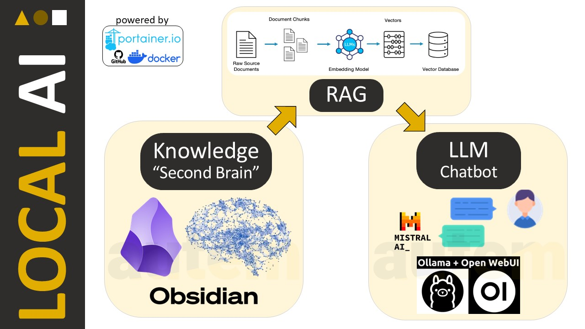
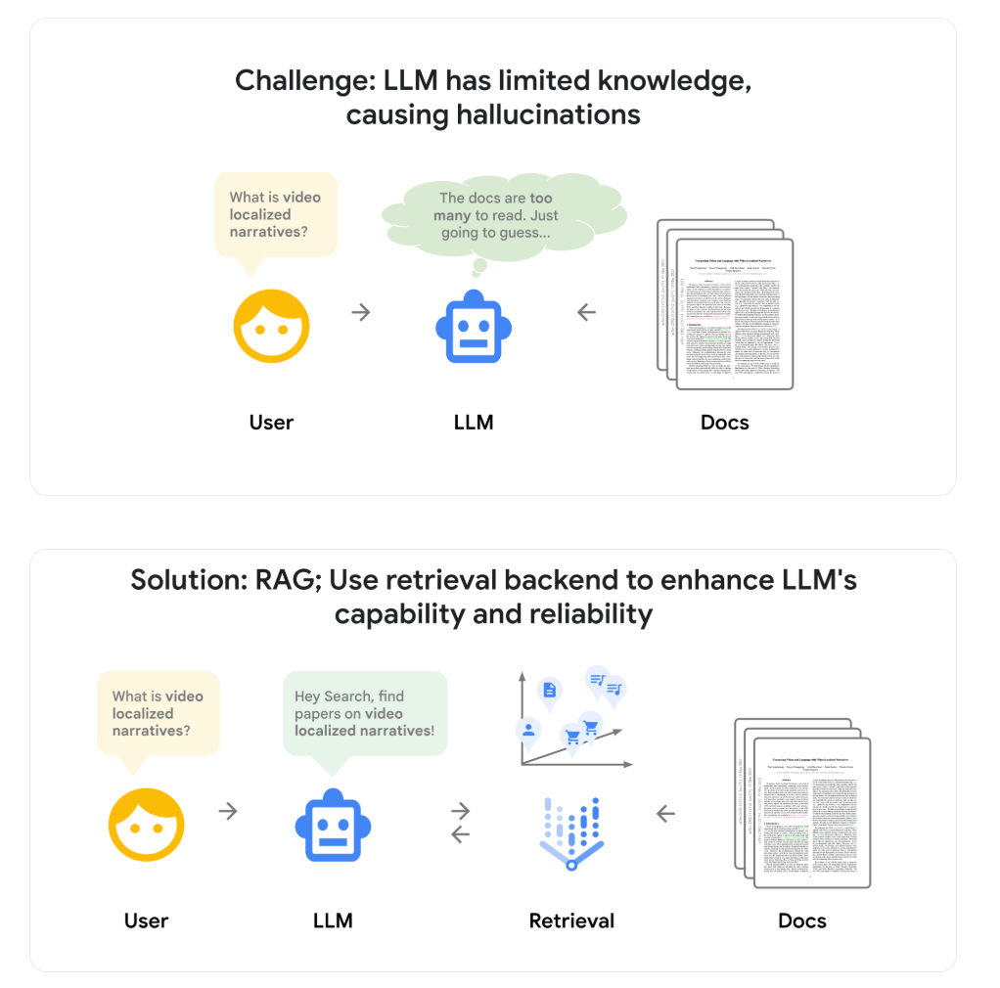

# Local AI-powered Knowledge Base

Turning AI and your technical Know-How into a private knowledge base, owned 💯 by your team.

Your private, lightweight, local AI 🛡️ with just 50 lines of docker-compose code in Portainer.

- **INPUT** : knowledge and technical notes in an Obsidian vault
- stored at the edge, synced across local servers by Syncthing
- enriched tech notes retrieval, with Arctic-Embed RAG by Snowflake
- fed into the lightweight 7B language model Q2_K by Mistral-ai
- **OUTPUT** : interactive knowledge chatbot with Open-WebUI

# The Stack #opensource

# Advantages

- ✅ **BUSINESS competitiveness**

Nowadays you can compete with the top engineering spheres 🚀 by just leveraging an opensource AI model and a lightweight GPU. Being a small team has never been so competitive. By analyzing our past track record, AI can bring expert suggestions, like a 2nd brain alive, or a specialized assistant. For such a specific knowledge domains as IndustrialAutomation 👷, our competitiveness increases by mixing legacy documentation methods (Zettelkasten mind mapping) with modern technology (LLM AI).

- ✅ **LEGACY Expertise**

The true differentiator with AI is not the technical stack. It’s your actual KnowledgeBase 🧠 :  your legacy inputs and your data vaults, maintained and documented over time, which feed the model. This brings back the power to collaboration 🤝 and knowledge sharing ♻️. Offshoring to external brains starts showing its limit, be it through ‘turnkey’ workforce or ‘off-the-shelf’ technology … In the Human versus Artificial battle, Humans are far from being obsolete !

# For more info : why using RAG ? 

*Source:* [How does RAG work ?](https://cloud.google.com/blog/products/ai-machine-learning/rags-powered-by-google-search-technology-part-1?hl=en)

 